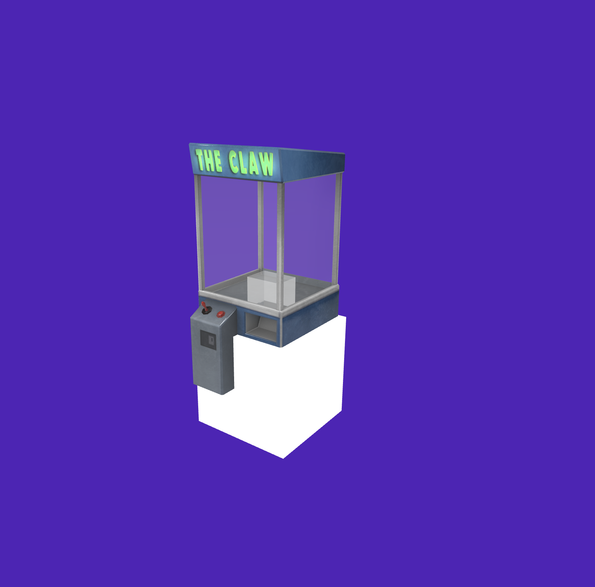

# 🕹️ The Arcade Room

A browser-based 3D arcade experience featuring multiple interactive games with realistic physics simulation. Built with Three.js and custom physics engine.



## 🎮 Features

### 🦾 Claw Machine
- **Realistic Physics**: Custom rigid body physics simulation with collision detection
- **Interactive Controls**: Move the claw with arrow keys/WASD, drop with down arrow
- **Dynamic Grabbing**: Advanced finger collision system for realistic object interaction
- **Cable Animation**: Dynamic cable that extends/retracts with claw movement
- **Prize Collection**: Collect stars and deliver them to the chute

### 🍬 Candy Machine
- **Multi-stage Animation**: Complex dispensing system with gate mechanics
- **Particle Effects**: Beautiful confetti and ribbon animations when candy is collected
- **Kinematic Physics**: Smooth candy movement through helper zones
- **Interactive Dispensing**: Insert coins and dispense candy with realistic animations

### 🍿 Popcorn Machine
- **Particle System**: Realistic popcorn popping effects
- **Sound Integration**: Audio feedback for immersive experience
- **Visual Effects**: Dynamic lighting and particle animations

### 🎯 Core Systems
- **Advanced Physics Engine**: Custom implementation with Vec3 mathematics
- **Dynamic Camera System**: Multiple camera modes including first-person and third-person
- **Lighting System**: Professional lighting setup with shadows and dynamic effects
- **Audio Management**: 3D positional audio with ambient effects
- **State Management**: Robust game state handling with mode transitions

## 🚀 Getting Started

### Prerequisites
- Modern web browser with WebGL support
- Local web server (recommended for development)

### Installation

1. **Clone the repository**
   ```bash
   git clone https://github.com/yourusername/arcade-room.git
   cd arcade-room
   ```

2. **Start a local web server**
   ```bash
   # Using Python 3
   python -m http.server 8000
   
   # Using Node.js (if you have http-server installed)
   npx http-server
   
   # Using PHP
   php -S localhost:8000
   ```

3. **Open in browser**
   Navigate to `http://localhost:8000` in your web browser

## 🎯 Controls

### Main Game
- **H** - Toggle pause menu
- **Arrow Keys / WASD** - Move around
- **Mouse** - Look around
- **Escape** - Exit machine mode

### Claw Machine Mode
- **Arrow Keys / WASD** - Move claw horizontally
- **Down Arrow** - Start drop sequence
- **P** - Toggle camera mode
- **R** - Force reset claw state (debug)
- **Escape** - Exit claw machine

### Candy Machine Mode
- **C** - Insert coin
- **M** - Start candy dispensing
- **Escape** - Exit candy machine

## 📁 Project Structure

```
arcade-room/
├── index.html                 # Main HTML file
├── main.js                   # Core game logic and initialization
├── style.css                 # Styling and UI
├── 
├── 🎮 Game Systems
├── game_initialization.js    # Game initialization system
├── physics_engine.js         # Custom physics simulation
├── physics_engine_vec3.js    # Vector mathematics
├── animation.js              # Particle effects and animations
├── event_handler.js          # Input handling
├── ui_manager.js            # User interface management
├── 
├── 🕹️ Arcade Machines
├── claw_controller.js        # Claw machine logic
├── candy_machine.js          # Candy machine system
├── popcorn.js               # Popcorn machine effects
├── grabbable_objects_interaction.js # Object interaction system
├── 
├── 🎥 Rendering & Effects
├── Camera_manager.js         # Camera system
├── Lights_manager.js         # Lighting system
├── Lightning_manager.js      # Dynamic lighting effects
├── Room_setup.js            # 3D scene setup
├── 
├── 🎵 Audio & Extras
├── AudioManager.js          # Audio system
├── extras.js               # Special effects and extras
├── Homepage.js             # Homepage management
├── MainHomepage.js         # Main homepage logic
├── 
├── 📦 Assets
├── glbmodels/              # 3D models (.glb files)
│   ├── claw_no_obj.glb
│   ├── candy_machine_con_gate5.glb
│   ├── popcorn_machine.glb
│   ├── star_prize.glb
│   └── ...
├── images/                 # UI images
├── sounds/                 # Audio files
└── paintings/             # Texture assets
```

## 🛠️ Technical Details

### Physics Engine
- Custom rigid body physics implementation
- Real-time collision detection using BVH (Bounding Volume Hierarchy)
- Constraint solving for realistic object behavior
- Kinematic and dynamic body support

### Graphics Pipeline
- **Three.js** for 3D rendering
- **WebGL** for hardware acceleration
- **GLTF/GLB** models for 3D assets
- Custom shaders for special effects

### Architecture
- **Modular Design**: Each machine is a separate module
- **Event-Driven**: Decoupled systems communicate via events
- **State Management**: Robust state handling for complex interactions
- **Performance Optimized**: Efficient rendering and physics updates

## 🔧 Development

### Key Classes

#### `ClawController`
Manages the claw machine mechanics:
- State machine for drop sequences
- Finger collision detection
- Cable animation system
- Physics integration

#### `CandyMachine`
Handles candy dispensing:
- Multi-stage animation pipeline
- Gate mechanics
- Kinematic body movement
- Particle effect integration

#### `PhysicsEngine`
Custom physics simulation:
- Rigid body dynamics
- Collision detection and response
- Constraint solving
- Spatial optimization

### Adding New Machines
1. Create a new machine class following the existing pattern
2. Add 3D model to `glbmodels/` directory
3. Implement physics interactions
4. Add controls to `event_handler.js`
5. Update the main game loop in `main.js`

## 🐛 Debugging

### Debug Features
- **R key** in claw mode: Force reset claw state
- **Console logging**: Extensive debug output available
- **State inspection**: Real-time state monitoring
- **Physics visualization**: Collision boundary display

### Common Issues
- **Claw won't descend**: Check `isAnimating` state and coin count
- **Candy teleportation**: Verify physics removal in animation system
- **Performance issues**: Monitor physics update frequency

## 🤝 Contributing

1. Fork the repository
2. Create a feature branch (`git checkout -b feature/amazing-feature`)
3. Commit your changes (`git commit -m 'Add amazing feature'`)
4. Push to the branch (`git push origin feature/amazing-feature`)
5. Open a Pull Request

## 📝 License

This project is licensed under the MIT License - see the [LICENSE](LICENSE) file for details.

## 🙏 Acknowledgments

- **Three.js** community for the excellent 3D library
- **GLB models** from various 3D artists
- **Physics simulation** inspiration from real arcade machines
- **Testing and feedback** from arcade enthusiasts

## 🎯 Future Features

- [ ] Multiplayer support
- [ ] High score system
- [ ] More arcade machines (pinball, air hockey)
- [ ] VR support
- [ ] Mobile controls
- [ ] Machine customization
- [ ] Achievement system

## 📞 Contact

- **Developer**: Riccardo D'Aguanno
- **Project Link**: https://github.com/yourusername/arcade-room

---

*Built with ❤️ and JavaScript*